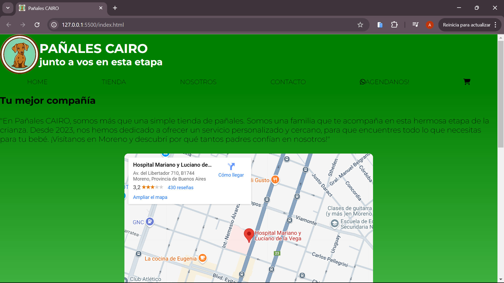

#PROYECTO E-COMMERCE

##Este proyecto está destinado a un cliente que quiere ingresar al mundo del comercio on-line y vender pañales de una marca específica. El sitio web va a estar compuesto por 4 páginas web de las cuales una esta destinada a la interfaz de una tienda para poder consultar y agregar los productos en otra pagina que contiene un carrito de compras. El objetivo es aumentar las ventas con estrategias digitales como Google ads y contacto a través de redes sociales.

##Las tecnologias aplicadas son HTML, CCS y JAVASCRIPT

